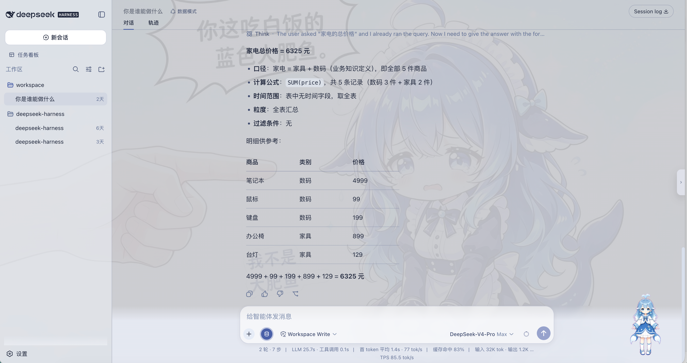
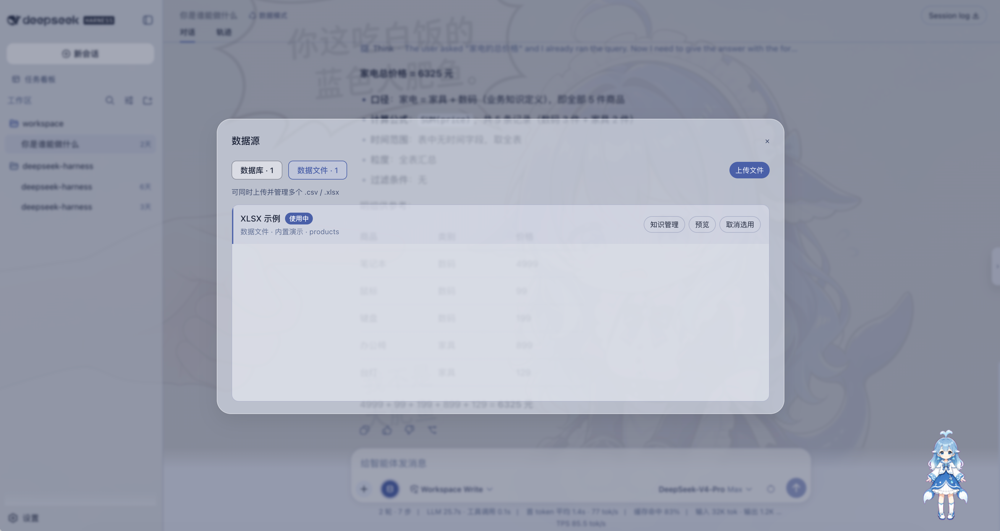
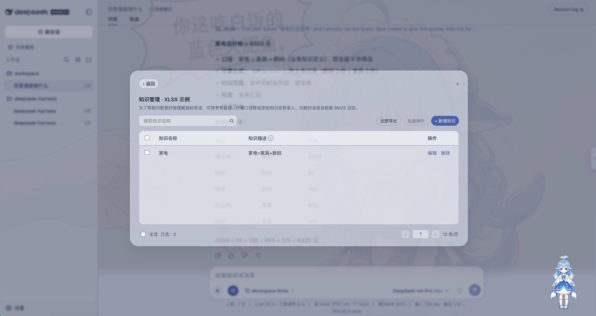

# dsh-data-mode

A DeepSeek Harness (DSH) plugin that adds a **Data Mode** session type for **read-only analytics in chat**.

Connect PostgreSQL, MySQL, or SQLite, or upload CSV / Excel files. Ask questions in natural language. The agent inspects schema, previews rows, and runs read-only SQL. You can also attach business definitions (metrics, aliases, formulas) to each source so answers follow your vocabulary.

The plugin is meant for **stock DSH** (web UI). It does not change the built-in Standard, PTC, Minimal, or Creative presets, and those sessions never see the SQL tools. New chats still default to Standard Mode. The Data source panel is localized in **Chinese and English**.

## Preview

Data Mode answering with a knowledge-defined metric:



Register and select a data source, then preview tables:



Maintain per-source knowledge (names, descriptions, BM25 recall):



## Why this exists

DSH is strong at coding agents. Data Mode is for a different job: **ask your own tables questions without leaving the conversation**, and without giving the model write access to the database.

Typical uses:

- “What were last month’s orders by category?”
- “Which SKUs are low on stock?”
- “Use our definition of GMV, not a guess.”

## Capabilities

### Data source registry

From the composer **Data source** control (visible only in Data Mode):

- Connect **PostgreSQL**, **MySQL**, or **SQLite**
- Upload **CSV** or **XLSX** tables into the workspace (the query engine can also read CSV / Parquet / XLSX when DuckDB is available)
- Preview tables and sample rows before asking
- Select exactly one source for the current session (unselected sources are invisible to the agent)
- Remove a registered source (its knowledge file is removed with it)

Passwords are stored in `$DSH_HOME/data-mode/secrets.yaml`, not in the catalog.

Built-in demos `demo-sqlite` and `demo-xlsx` appear when the catalog is empty, so you can try the flow immediately.

### Knowledge management

Each source has its own knowledge list (key → one or more values). Use it for metric definitions, business terms, and calculation rules.

- Create, edit, search, paginate, bulk-delete, and export to XLSX in the panel
- The same key may have multiple values
- Limits: key ≤ 100 characters, value ≤ 1000 characters, 200 entries per source
- On each question, matching keys are recalled (exact key in the question always hits; otherwise BM25 on keys) and injected into the system prompt as **口径**
- Knowledge never replaces real table or column names; the agent must still describe schema before SQL

### Ask-data agent

Only after you pick a source. Tools:

| Tool | Role |
| --- | --- |
| `list_data_sources` | Returns the **selected** source only (empty until you select one) |
| `describe_schema` | Required before querying those tables |
| `preview_rows` | Small sample (default 20 rows) |
| `run_sql` | Read-only `SELECT` / `WITH` / `EXPLAIN` / `SHOW` / `DESCRIBE` / `PRAGMA` |

SQL is refused if it is not read-only, if `LIMIT` exceeds **5000** (default **200**), or if referenced tables were not described first.

Routing:

- Off-topic / coding → answer without SQL tools; suggest Standard Mode
- Metrics, rank, share, trend, extrema → data-qa skill
- Attribution, forecasts, long reports → data-attribution skill and plan mode when there is more than one analysis step

Numerical answers should state the formula, time range, grain, and filters used in that turn. There is no separate certified metrics catalog.

## How it works

```
Composer (Data Mode only)
  └─ Data source button
        ├─ catalog HTTP API  (/api/dsh-data-mode)
        ├─ catalog.yaml      (registered sources)
        ├─ selections.yaml   (session → sourceId)
        └─ knowledge/*.json  (per-source terms)

Agent session (preset id: dsh-data)
  ├─ system prompt: selected source + recalled knowledge
  ├─ tools: list / describe / preview / run_sql  (isolated to this preset)
  └─ query engine: DuckDB (one in-memory DB per source)
                    fallbacks: node:sqlite, in-memory SQLite for XLSX
```

1. Installing the plugin registers a host **registrar** on the web profile (no model tools on the host) and copies the user preset `dsh-data` into `$DSH_HOME/.agent-presets/` if it is missing.
2. Choosing **Data Mode** for a new session mounts the SQL tools, DuckDB provider, SQL guard, and prompt context **only in that session**.
3. The web client mounts the Data source control on the composer. If the host provides a dedicated datasource seat, the button sits there; otherwise it uses the stock composer tool row so stock DSH still gets a working control.
4. Selecting a source writes `selections.yaml`. The agent and the four tools can see **that source only**.
5. Questions assemble context **before** the user message is stored: selected source plus BM25-recalled knowledge.
6. Queries run against an isolated in-memory DuckDB per source (so table names do not collide). SQLite attaches when a local sqlite scanner extension is already present (the plugin does **not** auto-download extensions). Pure XLSX is loaded as in-memory tables. PostgreSQL SSL adds `sslmode=require`; MySQL does not use `sslmode`.

## Install

Requires DSH **web** (`dsh web`), Node `^22.19.0 || >=24`, and a **new** chat after install.

```sh
dsh plugin --profile web add github:tieveto666-code/dsh-data-mode
```

Or install a release tarball (includes compiled `lib/`):

```sh
dsh plugin --profile web add ./dsh-data-mode-0.1.0.tgz
```

Local checkout:

```sh
dsh plugin --profile web add link:/path/to/dsh-data-mode
```

Restart `dsh web`. Open a **new** session and choose **Data Mode**. Existing Standard sessions will not show the button or SQL tools.

### DuckDB native addon

`duckdb` is optional. With the native addon, SQLite, XLSX, CSV, Parquet, PostgreSQL, and MySQL all go through DuckDB. Without it, SQLite and pure XLSX still work via Node fallbacks.

pnpm 10+ may ask whether to compile `duckdb`. Answer before `dsh plugin add` or the command will sit idle:

```sh
pnpm config set allowBuilds.duckdb true   # CSV / Parquet / Postgres / MySQL
pnpm config set allowBuilds.duckdb false  # SQLite / XLSX demos only
```

Or in that web profile’s `pnpm-workspace.yaml`:

```yaml
allowBuilds:
  duckdb: true
```

## Usage

1. New session → **Data Mode**.
2. Open **Data source**, register or pick a database/file. Until one source is selected, `list_data_sources` is empty and the agent must not invent catalog ids.
3. Ask the question. Optional: add knowledge keys for that source so metric names match your business language.

## Files on disk

| Path | Purpose |
| --- | --- |
| `$DSH_HOME/data-mode/catalog.yaml` | Process-level source registry |
| `<workspace>/.dsh/data-mode/catalog.yaml` | Workspace overlay (same id wins) |
| `$DSH_HOME/data-mode/selections.yaml` | Session → selected `sourceId` |
| `$DSH_HOME/data-mode/secrets.yaml` | Database passwords |
| `$DSH_HOME/data-mode/knowledge/<sourceId>.json` | Knowledge for that source |
| `$DSH_HOME/.agent-presets/dsh-data/` | Copied user preset (created if missing, never overwritten) |

Catalog field notes: [`examples/catalog.yaml`](examples/catalog.yaml). Uploaded files land under the workspace `.dsh/data-mode/uploads/` directory.

## Isolation

Install does **not**:

- Change `agent-presets.default`
- Patch the host `agent-presets` roster row
- Register `run_sql` / `list_data_sources` on Standard, PTC, Minimal, or Creative
- Overwrite an existing `dsh-data` preset directory that this package did not install

Install **does**:

- Mount the registrar and catalog HTTP API on the web profile
- Copy the Data Mode preset when absent
- Expose SQL tools and the Data source control only in `dsh-data` sessions

## Uninstall

```sh
dsh plugin --profile web remove dsh-data-mode
```

Optional: delete `$DSH_HOME/.agent-presets/dsh-data`. Native presets are unchanged.

Issues: [github.com/tieveto666-code/dsh-data-mode/issues](https://github.com/tieveto666-code/dsh-data-mode/issues)

## Limits

- Read-only SQL only; no `INSERT` / `UPDATE` / `DELETE` / DDL through the agent
- No certified semantic layer (`metrics.yaml` / compiled 口径)
- No MongoDB, Oracle, SQL Server, Snowflake, dashboards, row-level security, or streaming OLAP
- Knowledge is lexical retrieval on keys, not a full document search engine

## License

MIT © Changsheng Tie (tieveto666-code)

See [LICENSE](./LICENSE).
